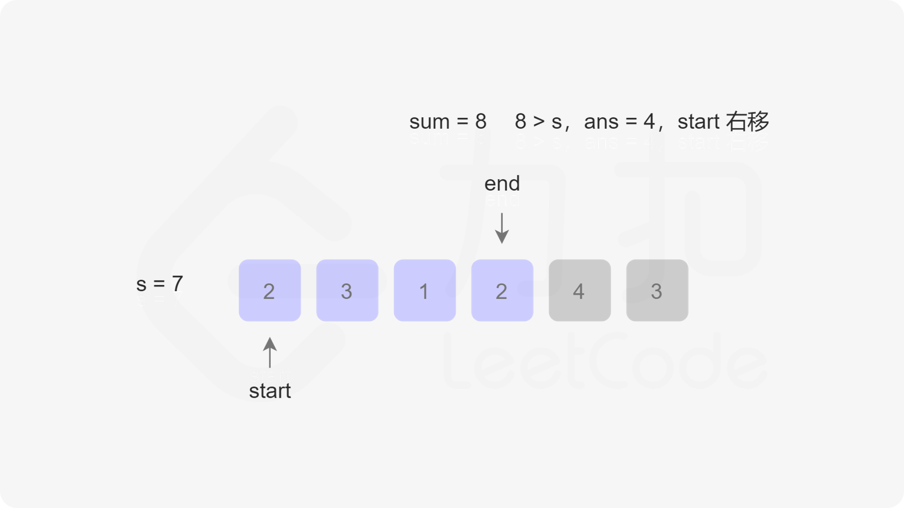

# 11. Container With Most Water
## 题目
- Given an array of positive integers nums and a positive integer target, return the minimal length of a contiguous subarray [numsl, numsl+1, ..., numsr-1, numsr] of which the sum is greater than or equal to target. If there is no such subarray, return 0 instead.

>Input: target = 7, nums = [2,3,1,2,4,3]
>Output: 2
 
>Input: target = 4, nums = [1,4,4]
>Output: 1
 
>Input: target = 11, nums = [1,1,1,1,1,1,1,1]
>Output: 0 

## 解题思路
- 暴力循环
- 前缀和+二分查找
  * 创建前缀和数组
  * 遍历原数组
    + 对sums进行二分查找，找到比target+sums[i-1]的值的下标bound
    + bound-(i-1)即当前情况下，和大于target需要的元素的个数
- 滑动窗口!
 
 
  
 
 
 
 
 
 
 
 
  