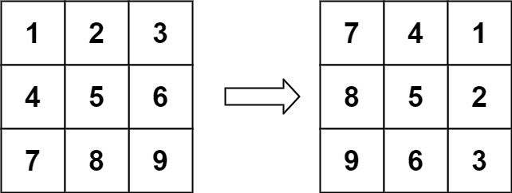
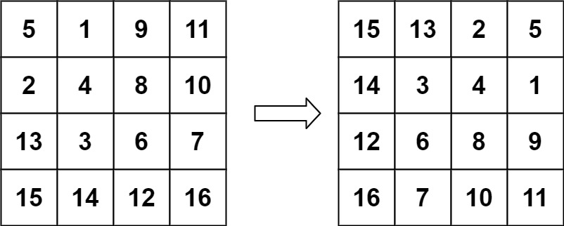
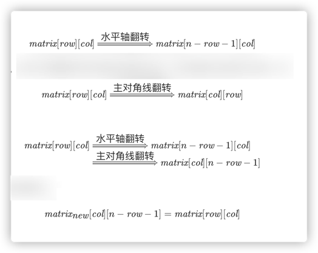

# 48. Rotate Image

## 题目

- You are given an n x n 2D matrix representing an image, rotate the image by 90 degrees (clockwise).

- You have to rotate the image in-place, which means you have to modify the input 2D matrix directly. DO NOT allocate another 2D matrix and do the rotation.

> Input: matrix = [[1,2,3],[4,5,6],[7,8,9]]
> Output: [[7,4,1],[8,5,2],[9,6,3]]

> Input: matrix = [[5,1,9,11],[2,4,8,10],[13,3,6,7],[15,14,12,16]]
> Output: [[15,13,2,5],[14,3,4,1],[12,6,8,9],[16,7,10,11]]
> 

> Input: matrix = [[1]]
> Output: [[1]]

> Input: matrix = [[1,2],[3,4]]
> Output: [[3,1],[4,2]]

## 解题思路

- 找规律+辅助数组(图中最后一行公式***重点，找到这个规律就比较容易得到这两个方法)
- 用翻转代替旋转(先水平翻转，再对称翻转，第三行公式)
