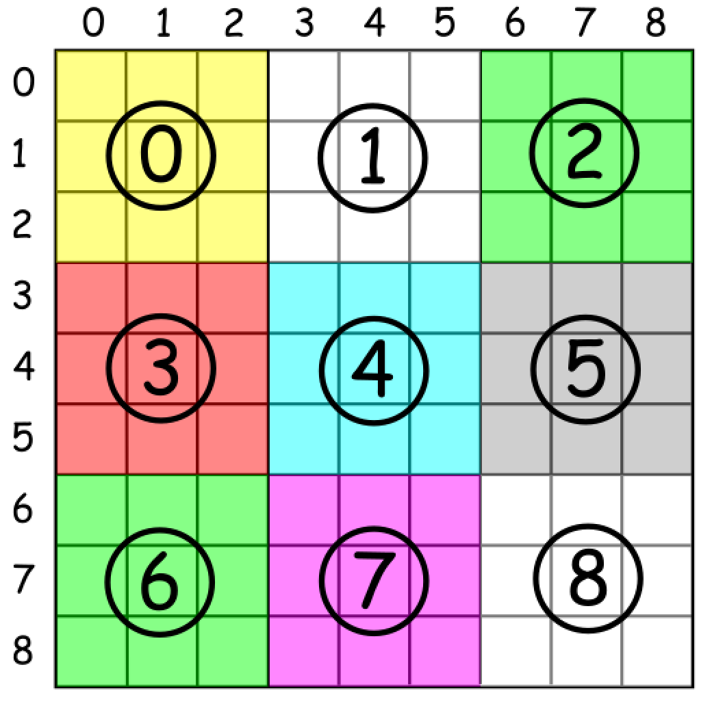

# 36. Valid Sudoku

## 题目

- Determine if a 9 x 9 Sudoku board is valid. Only the filled cells need to be validated according to the following
  rules:

    - Each row must contain the digits 1-9 without repetition.   
    - Each column must contain the digits 1-9 without  
      repetition. 
    - Each of the nine 3 x 3 sub-boxes of the grid must contain the digits 1-9 without repetition.

格子计算参考此图

> Input: board =
[["5","3",".",".","7",".",".",".","."]
,["6",".",".","1","9","5",".",".","."]
,[".","9","8",".",".",".",".","6","."]
,["8",".",".",".","6",".",".",".","3"]
,["4",".",".","8",".","3",".",".","1"]
,["7",".",".",".","2",".",".",".","6"]
,[".","6",".",".",".",".","2","8","."]
,[".",".",".","4","1","9",".",".","5"]
,[".",".",".",".","8",".",".","7","9"]]
> Output: true

> Input: board =
[["8","3",".",".","7",".",".",".","."]
,["6",".",".","1","9","5",".",".","."]
,[".","9","8",".",".",".",".","6","."]
,["8",".",".",".","6",".",".",".","3"]
,["4",".",".","8",".","3",".",".","1"]
,["7",".",".",".","2",".",".",".","6"]
,[".","6",".",".",".",".","2","8","."]
,[".",".",".","4","1","9",".",".","5"]
,[".",".",".",".","8",".",".","7","9"]]
> Output: false

## 解题思路

- 三个二维数组分别记录行、列、格子中已经出现的数字
- 例如，如果board[0][0]=8，则第0行，第0列和第0个均 不能再出现8，可以标记第0行第7个(下标为0-8，所以减1)，第0列第7个 以及第0个格子第7个标记为true(表示已出现)。
- 如果board[0][6]=8，则检查第0行(列，格子),第7个，发现为true， 说明出现了重复数字，是无效的数独。
 