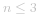

#### 解题思路：

- 设将长度为 *n* 的绳子切为 *a* 段：

*
n = n_1 + n_2 + ... + n_a
*

- 本题等价于求解：

 

> 以下数学推导总体分为两步：① 当所有绳段长度相等时，乘积最大。② 最优的绳段长度为 *3* 。

##### 数学推导：

- 以下公式为“算术几何均值不等式” ，等号当且仅当 *n_1 = n_2 = ... = n_a* 时成立。

![\frac{n_1+n_2+...+n_a}{a}\geq\sqrt\[a\]{n_1n_2...n_a} ](./p____frac{n_1_+_n_2_+_..._+_n_a}{a}_geq_sqrt_a_{n_1_n_2_..._n_a}___.png) 

> **推论一：** 将绳子 **以相等的长度等分为多段** ，得到的乘积最大。

- 设将绳子按照 *x* 长度等分为 *a* 段，即 *n = ax* ，则乘积为 *x^a* 。观察以下公式，由于 *n* 为常数，因此当   取最大值时， 乘积达到最大值。

 

- 根据分析，可将问题转化为求   的极大值，因此对 *x* 求导数。

$$
\begin{aligned}
 \ln y & = \frac{1}{x} \ln x & \text{取对数} \\
 \frac{1}{y} \dot {y} & = \frac{1}{x^2} - \frac{1}{x^2} \ln x & \text{对 *x* 求导} \\
 & = \frac{1 - \ln x}{x^2} \\
 \dot {y} & = \frac{1 - \ln x}{x^2} x^{\frac{1}{x}} & \text{整理得}
\end{aligned}
$$

- 令   ，则   ，易得驻点为   ；根据以下公式，可知 *x_0* 为极大值点。

![\dot{y}\begin{cases}>0&,x\in\[-\infty,e)\\<0&,x\in(e,\infty\]\\\end{cases} ](./p____dot_{y}__begin{cases}_____0_&_,_x_in__-_infty,_e_______0_&_,_x_in__e,_infty____end{cases}___.png) 

- 由于切分长度 *x* 必须为整数，最接近 *e* 的整数为 *2* 或 *3* 。如下式所示，代入 *x = 2* 和 *x = 3* ，得出 *x = 3* 时，乘积达到最大。

 

- 口算对比方法：给两数字同时取 *6* 次方，再对比。

![\[y(3)\]^6=(3^{1/3})^6=9\\\[y(2)\]^6=(2^{1/2})^6=8 ](./p_____y_3__^6_=__3^{1_3}_^6_=_9____y_2__^6_=__2^{1_2}_^6_=_8___.png) 

> **推论二：** 尽可能将绳子以长度 *3* 等分为多段时，乘积最大。

##### 切分规则：

1. **最优：** *3* 。把绳子尽可能切为多个长度为 *3* 的片段，留下的最后一段绳子的长度可能为 *0,1,2* 三种情况。
2. **次优：** *2* 。若最后一段绳子长度为 *2* ；则保留，不再拆为 *1+1* 。
3. **最差：** *1* 。若最后一段绳子长度为 *1* ；则应把一份 *3 + 1* 替换为 *2 + 2*，因为  。

##### 算法流程：

1. 当   时，按照规则应不切分，但由于题目要求必须剪成 *m>1* 段，因此必须剪出一段长度为 *1* 的绳子，即返回 *n - 1* 。
2. 当 *n>3* 时，求 *n* 除以 *3* 的 整数部分 *a* 和 余数部分 *b* （即 *n = 3a + b* ），并分为以下三种情况：
    - 当 *b = 0* 时，直接返回 *3^a*；
    - 当 *b = 1* 时，要将一个 *1 + 3* 转换为 *2+2*，因此返回  ；
    - 当 *b = 2* 时，返回  。


##### 复杂度分析：

- **时间复杂度 *O(1)* ：** 仅有求整、求余、次方运算。
  - [求整和求余运算](https://stackoverflow.com/questions/35189851/time-complexity-of-modulo-operator-in-python)：资料提到不超过机器数的整数可以看作是 *O(1)* ；
  - [幂运算](https://stackoverflow.com/questions/32418731/java-math-powa-b-time-complexity)：查阅资料，提到浮点取幂为 *O(1)* 。
- **空间复杂度 *O(1)* ：** 变量 `a` 和 `b` 使用常数大小额外空间。

#### 代码：

> Python 中常见有三种幂计算函数： **`*`** 和 **`pow()`** 的时间复杂度均为   ；而 **`math.pow()`** 始终调用 C 库的 `pow()` 函数，其执行浮点取幂，时间复杂度为 *O(1)* 。

```python []
class Solution:
    def cuttingRope(self, n: int) -> int:
        if n <= 3: return n - 1
        a, b = n // 3, n % 3
        if b == 0: return int(math.pow(3, a))
        if b == 1: return int(math.pow(3, a - 1) * 4)
        return int(math.pow(3, a) * 2)
```

```java []
class Solution {
    public int cuttingRope(int n) {
        if(n <= 3) return n - 1;
        int a = n / 3, b = n % 3;
        if(b == 0) return (int)Math.pow(3, a);
        if(b == 1) return (int)Math.pow(3, a - 1) * 4;
        return (int)Math.pow(3, a) * 2;
    }
}
```

> 数学推导需要一定的知识基础。下面分享一种基于贪心思想的思路，个人认为适合于时间有限情况下的快速解题。

##### 贪心思路：

> 设一绳子长度为 *n* ( *n>1* )，则其必可被切分为两段 *n=n_1+n_2* 。
> 根据经验推测，切分的两数字乘积往往原数字更大，即往往有   。
>
> - **例如绳子长度为 *6* ：**    ；
> - **也有少数反例，例如 *2* ：**   。

- **推论一：** 合理的切分方案可以带来更大的乘积。

> 设一绳子长度为 *n* ( *n>1* )，**切分为两段** *n=n_1+n_2* ，**切分为三段** *n=n_1+n_2+n_3* 。
> 根据经验推测，**三段** 的乘积往往更大，即往往有 *n_1 n_2 n_3 > n_1 n_2* 。
>
> - **例如绳子长度为 *9* ：** 两段 *9=4+5* 和 三段 *9=3+3+3*，则有   。
> - **也有少数反例，例如 *6* ：** 两段 *6=3+3* 和 三段 *6=2+2+2*，则有   。

- **推论二：** 若切分方案合理，绳子段切分的越多，乘积越大。

> 总体上看，貌似长绳子切分为越多段乘积越大，但其实到某个长度分界点后，乘积到达最大值，就不应再切分了。
> **问题转化：** 是否有**优先级最高的长度** *x* 存在？若有，则应该尽可能把绳子以 *x* 长度切为多段，以获取最大乘积。

- **推论三：** 为使乘积最大，只有长度为 *2* 和 *3* 的绳子不应再切分，且 *3* 比 *2* 更优 *（详情见下表）* 。

| 绳子切分方案  | 乘积                                       |      结论                                        |
| ------------- | ------------------------------------------ | ----------------------------------------------- |
| *2 = 1 + 1*   |                             | *2* 不应切分                                     |
| *3=1+2*       |                             | *3* 不应切分                                     |
| *4=2+2=1+3*   |            | *4* 和 *2* 等价，且 *2+2* 比 *1+3* 更优           |
| *5=2+3=1+4*   |            | *5* 应切分为 *2+3*                               |
| *6=3+3=2+2+2* |   | *6* 应切分为 *3+3* ，进而**推出 *3* 比 *2* 更优** |
| *>7*          | ...                                        | **长绳**（长度>7）可转化为多个**短绳**（长度1~6），因此肯定应切分 |